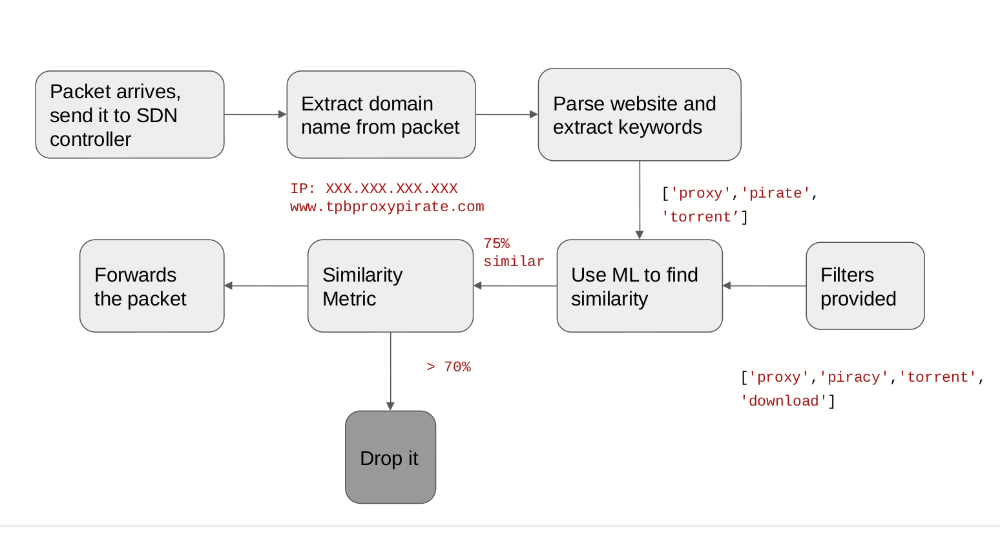
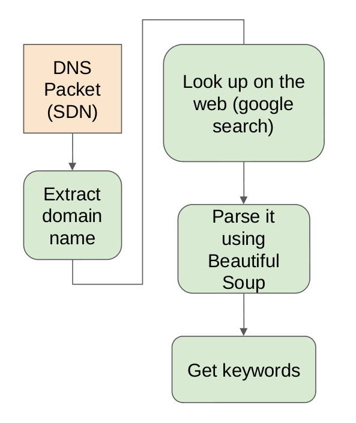
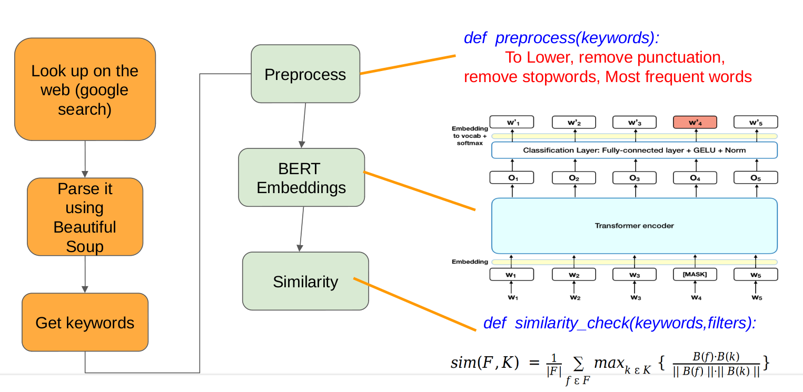

# Packet-Filtering-in-SDNs-with-ML
Given a filter, only traffic deemed legitimate by this filter will be allowed.

Avoid incoming traffic from websites hosting unwanted content with a domain name which cannot does not indicate the same

### Motivation
The current firewalls can easily be fooled, for example using content spoofing. Rules for dropping packets from website with a good domain name but hosting unwanted data, is rather difficult to set in traditional firewalls.

We aim to solve this problem using SDNs and ML.

### Workflow

### Setup
- Operating System = Windows 11
- Programming Language = Python3
- APIs = beautifulsoup, Huggings Face, Sentence transformers, scapy
